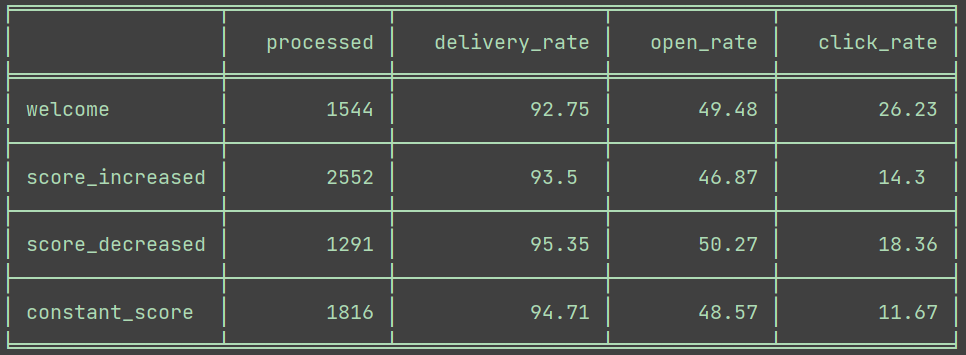

# Task 1: Parsing and data analysis
The task is to analyze the data contained in the "data.csv" file, which contains information obtained from SendGrid about sent emails.

## Solution
To solve this task, we used the Python programming language with the `Pandas` library. The data from the file was analyzed and calculations were made according to the required parameters, after which they were visualized using the `tabulate` library. The solution code is in the `solution1.py` file. 

As a result of the solution, we obtain the following table:

During the analysis, it was found that for some letters the calculation of the uniqueness of the event does not work correctly, which can probably be a bug.

# Task 2: SQL queries
The task is to write the following SQL queries:

1. A query to calculate the average and median value of signed loans for the last 60 days from the date of calculation. Special SQL functions are not allowed.
2. A query to find duplicate credit applications after a registration error in the database.
3. A query to present a conversion funnel by counties from user registration on the platform to loan application. The resulting table should contain the following columns: "county", "registrations", "passed_KYC", "offers", "contracted_loans", "contracted_loans_to_offers_rate", "contracted_loans_to_registrations_rate".

## Solution
To solve this task, we used the PostgreSQL database management system. The queries are presented in the `solution2.sql` file.

You can also view the database structure in the **db-fiddle** service by following the links:
1. [first query](https://www.db-fiddle.com/f/vP8yP1psQsMd6T91q2BYfV/4)
2. [second query](https://www.db-fiddle.com/f/7DbkXvr3vGZukYwdz7jStN/4)
3. [third query](https://www.db-fiddle.com/f/3FkK12VmdaoaX2izBKmnRv/2)
